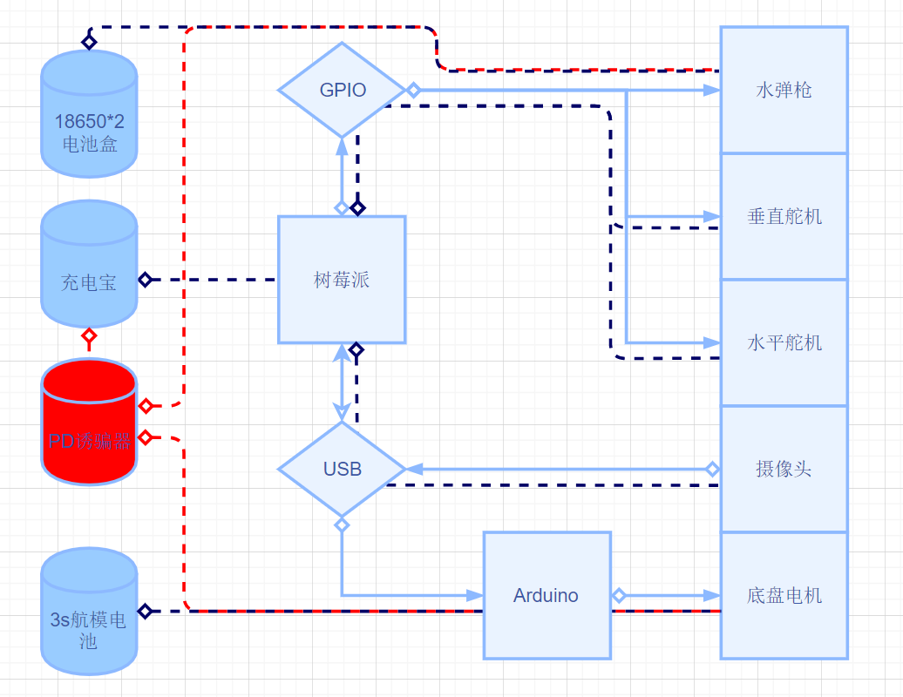

# RM2021-dingyang666 战队 技术报告

- 作者：丁昊 <hydrogendeuterium1@gmail.com>
- 源代码公开仓库：[链接](https://github.com/NJTUSTAS/RM2021-dingyang666)

## 概览

我们这里先给出一张车体照片，其中为树莓派供电的充电宝被卸下：


<div style="page-break-after:always"></div>

接下来给出车体的供电/控制架构图。



图中：

- 方块为工作设备（组）
- 菱形块为设备的 IO 界面
- 圆柱体为供电设备
- 实心箭头表示信号流向
- 虚线代表供电来源

<div style="page-break-after:always"></div>

以下给出用到的主要设备与其价格：

|设备名称|数量|全新售价|二手售价（残值）|备注|
| ---- | -- | ---- | ----------- | ---- |
|树莓派 4B|1|800-1000，视配置和配件而定|600-800|损坏未使用|
|树莓派 3B|1|600-700|400-500|自有，用于替换损坏的 4B|
|USB 免驱摄像头 720p|1|70|10|实测 1 米线材过长，也可使用 CSI 摄像头|
|云台（水弹枪+舵机）|1|215|0|不要买我们这种 枪坏了两回，舵机抖动很厉害|
|MG-996R舵机|2|算在云台里|-|垂直舵机扭力一定要大，15KG以上，我们这个不够；水平舵机要稳，不然射击会抖动|
|水弹枪含波箱供电|1|算在云台里|-|不要买这种水弹枪 非常乐色不好用，方案是十年前的老古董。非常容易卡弹，一共换了 2-3 把才能用，建议找别的方案的枪。|
|yfrobot 四路电机拓展版|1|58|0|只提供了 Arduino 例程，非 Arduino 方案建议考虑其他电机拓展板，Arduino 方案与之契合良好|
|Arduino Uno|1|130左右|50|保有量大 你可以考虑找有这个的人借过来白嫖用到时候再还|
|编码器电机|4|183含邮费|0|没有用上编码器功能，理论上可以买更加便宜的|
|充电宝|1|200/50|100/30|一开始预备使用兼容PD的充电宝输出 12V 给水弹枪与电机，价格会较高|
|PD诱骗|1|20|0|预赛前一天诱骗器损坏，没有使用|
|12 V 航模电池|1|35|-|诱骗器损坏的备选方案；便宜但是接线和充电等都不是很好处理|
|初始方案合计||1800左右|850左右|树莓派涨价很厉害|
|最终方案合计||741|90|没有计算自有的树莓派价格。|

这里没有计算制作需要的耗材（如杜邦线，铜柱，从隔壁组白嫖的亚克力车体板，胶带，扎带，热熔胶等固定设备）和耐用工具（如可调电源，万用表，螺丝刀，扳手，美工刀，卷尺，热熔胶枪等），还有一些制作设计测试用的标靶也没有统计在内。

从结果来看，通过亚克力板+铜柱固定的车身刚性不足，导致小车运行时速率和方向波动偏差较大，所以这是一个不合理的选择。

## 源代码结构

本次比赛所有最后使用到的脚本都存放在仓库的 /src 目录下。

```shell
pi@pi4:~/RoboMaster $ tree src
src #源码根目录
├── car #存放整车相关代码
│   ├── __init__.py #小车初始化
│   ├── chassis #小车底盘部分相关代码
│   │   ├── __init__.py #与 Arduino 通信进行小车底盘控制
│   │   └── motor.cpp #小车电机控制，刷入 Arduino 中运行
│   └── pan #存放云台相关代码
│       ├── __init__.py #云台部分初始化
│       ├── camera.py #摄像头读取并分析画面
│       ├── gun.py #水弹枪射击控制
│       └── servo.py #舵机控制
├── __init__.py #标记 Python 包，这个文件没有用
├── formal.py #正赛小车运行脚本
├── pre.py #预赛小车运行脚本
├── pre-test.py #预赛小车测试脚本
└── shoot.py #小车射击脚本
```

## 视觉识别，瞄准与射击

我们的小车使用 Python 作为主要工作语言，Python 提供了 `apriltags` 库来进行识别。这个库不提供 Windows 版本，在前期本机测试的时候可以考虑使用 `pupil-apriltags` 库，二者输出结果完全兼容。后者也有 Linux 平台的版本，受限于时间没有进一步测试二者的差异。

值得探究的是，相比于上一届，我们的树莓派在性能大大落后的情况下识别速率却大大提升（树莓派 3B 下的 8 FPS，相较于上一届树莓派 4B 下的 4 FPS），这是值得探讨的。我们认为这可能是因为管道通信的原因导致的。

另一个问题是在舵机调整的时候进行摄像，可能会导致画面模糊，从而无法识别到结果，我们采取了获取图像前等待 0.5秒 的方案来规避这一结果。今年我们的小车使用了水平和垂直的双向舵机，因此精度较高，射击时不需要调整车体，这使得我们只需要 P 控制即可完成瞄准操作，这大大简化了算法的设计。

舵机的控制需要 PWM 信号控制，树莓派的 GPIO 库提供了此类功能。经过实验调整，在我们的射击距离和分辨率（1280*720）下，舵机调整的合理比例常数可以达到 0.035，即每相差大约28 像素转动舵机 1°。当转动角度小于 1° 时我们认为达到了舵机的精度限制而不再继续精细瞄准。我们认为，通过提高比例常数，并且加入积分和微分控制来消除波动的方式可以进一步提高小车的瞄准周期，但因为备赛时间不够充分，没有进行此类参数调整。

舵机在两个方向的运动与射击都应当可以同时进行（这为扫射方案提供很大助力），这需要进行异步操作。由于 Python 的异步操作并不如 js 那么完善，因此我通过 `contextlib.contextmanager` 生成了上下文管理器，以达到异步操作的目的。

在射击时，水弹枪无法正常击发是一个严重的问题，在参赛时遇到此类现象，遗憾退赛的队伍也不在少数，例如我们在 预赛中的最大对手，“再睡十分钟” 战队就遗憾的在正赛遇到了同样的问题，挣扎良久后不得不含恨而终，这只取得了预赛第一名的队伍在参赛队伍里最终成绩倒数第二。

除了多次测试与更换水弹枪这样的硬件问题，我们在软件层面也针对这个问题进行了适配。这是一个被戏称为“摇摇乐”的函数，作用是在射击前快速转动舵机，使得弹仓内的水单能够均匀分布，从而提高射击的成功率。

尽管有这样的准备，但是备赛时间并不充足，临场环境千变万化，还是有可能出现小车无法正确识别目标的可能性，为了保证“能够恰到自动射击的烂分”，我们也开发了一种扫射的兜底方案，小车在射击时不断变换水平角度，覆盖正前方的 90° 区域，虽然不能识别目标，但是也是规则允许的自动射击范畴之内，可以获得更高的分数。

扫射会发生在识别失败和射击完成之后，可以有效起到补刀作用。本次比赛的第二名 “代码写不队” 战队在第二个射击点处就出现了自动射击命中了前三个目标，但在最后一个目标时出现卡弹射失的情况。如果他们能够进行扫射，则其得分将达到 450，超越我们取得第一。

## 电机控制

由于电控水平的不足，我们无法做到像去年的“STAS”战队那样精确控制电机的能力。我们使用树莓派与 Arduino 进行串口通信，并且使用 USB 串口来回避树莓派的一些问题（具体问题可以参见 2020 年 STAS 战队提交的技术报告）

树莓派和 Arduino 的通信非常简单，树莓派只发送而不接受任何反馈信息，发送信息对应的动作如下:
- W：快速前进
- w：慢速前进
- S：快速后退
- s：慢速后退
- A：快速左转
- a：慢速左转
- D：快速右转
- d：慢速右转

尽管已经有所考虑，但还是存在一些问题：慢速模式的旋转角度太小，以至于调整控制非常的缓慢，这和我们的轮子选用普通的橡胶轮有关，如果选用麦克纳姆轮的话，我们可以较好的应用“撞墙”法来修正车体的角度，而不是只能通过开环方式通过延时控制来使得车体大约旋转 90° 而祈祷小车不会撞到墙壁。

除此之外，使用麦轮还允许小车进行平移，这可以减少大量旋转操作带来的误差。在一开始的方案中，我们通过精确控制电机运行时间的方案来使得车体前进指定距离；但由于车体的运行距离和时间并非线性关系，这一目标被证明难以实现。最终让我们放弃全自动比赛的问题是转向问题，由于车轮在转向时一定会发生侧向滑动，这使得车体的转向角受到场地的变化非常不稳定。

由于我们的小车可以方便的前后运动，我们一开始寄希望于控制小车面向的方法，即永远保证小车面向东面或背面，这使得两个连续的旋转操作的方向一定相反，从而抵消部分误差的影响。但实际场地的测试结果证明了，对于没有使用编码器对运动进行闭环控制的小车，这样的方法精度仍然难以达到目标。

最终在多次尝试下，我们的小车完成了从入口 a 到射击点A，以及勉强完成了从射击点 B 到出口 b 的自动行驶，前者经历了 4 个转弯而后者需要 5 个。但作为代价，我们的比赛时间也消耗殆尽，我们一共只进行了一次尝试，好在运气还不错，才最终获得了现在的成绩。

## 路线规划

想要在比赛中取得较好的成绩，还离不开的一点就是比较合理的路径规划。可能是比赛的设计问题，完全不含自动的战队，完美完成整个赛程的得分一共是 230 分，而通过自动行驶到达第一个存档点并且进行按照顺序的自动射击，得分也有 230 分（自动到达存档点 50，自动射击 20*4，射击顺序正确 100）。在赛前的备赛过程中我了解到这一次 RM 的参赛热门是运输分拣项目，迷宫射击项目所有参赛战队中大部分都采取遥控方案，因此只要能够拿满 230 分，那么就很有可能取得较好的排名。

前文电机控制中提到了，尽管精度不足，但在精确测量旋转需要时间和进行了一些补偿修正的情况下，小车勉强可以进行4-5次旋转，这使得自动到达第一个存档点和自动停车成为了可能。在预赛中我们就出现了时间不足的问题，在决定了通过 ab 两个出入口进出之后我们就果断决定放弃射击点 C，因为射击点 C 入口的路线过于蜿蜒崎岖，从射击点A 到射击点 B 跨越了整个赛场需要进行 9 次旋转，而从射击点 C 最近的出入口 c 到达也需要9个弯，而离开射击点 C 也是同样的情况。

在比赛的过程中，由于没有预料到慢速旋转的旋转角度不足的问题，遥控从射击点 A 到前往射击点 B 的耗费时间大大超乎预期，如果我们没有果断的放弃射击点C，那么在第一个射击点没有成功按照顺序射击的情况下大概率不可能到达C点进行射击，更不用说在这之后的返回b点自动离场了（+50-100分，作为对比遥控离场只有5分）。

最终，我们的规划就是，从射击点 A 进场，手动遥控到达射击点B，然后进行两次射击。在较坏的情况下，射击识别失败导致没有顺序分的情况下，也能得到入场 50+第一个射击 80+遥控到达第二个点 15+第二个射击 80+离场至少 50，共275分，甚至允许8组靶标中两组射失。事实证明结果比想象中好，虽然第一组射击没有正确识别，但第二组的射击圆满成功，离场虽然不顺利但也是成功了一半，这足以说明在备赛并不彻底充分的情况下，选择合适的路径也是非常重要的。

## 还存在的问题


- 虽然在实际场地中没有出现这样的情况，但是在测试的时候多次出现摄像头离线的情况，其中的原因我们至今没有能弄明白
- 我们使用的电机带有编码器，实际上我们可以通过编码器返回的结果来精确地控制小车行进，这一点我们并未实现。但我们同样认为这是和小组内缺乏擅长电控的队员有一定关系。
- 我们并未识别墙上的 AprilTag，我们可以利用这些 AprilTag 做什么？事实上整个比赛也没有任何一个战队识别了墙上的标签，我认为这些标签的应用难度相当高，如果主办方不能提供一定的示范的话，明年的迷宫射击可能和去年一样，这些帮助小车定位的二维码还是难以起到作用。
- 由于 PD 诱骗设备损坏，我们不得不使用三个电池为树莓派、电机、水弹枪供电，这本可以避免。
- 多数充电宝在双口同时输出时，PD 侧功率下降较大，可能不能达到预定的输出；使用 PD 单口输出 12 V，再通过减压供应 5 V 或许会更加合理。
- 在上面的情况下水弹枪和电机都是感性负载，启动时可能导致输出的压降较大，可以考虑在电路中并入电容来降低影响。